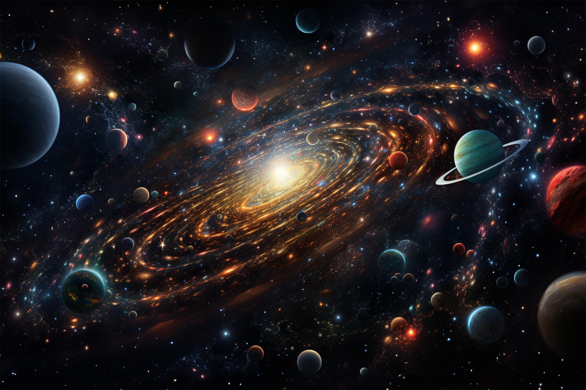
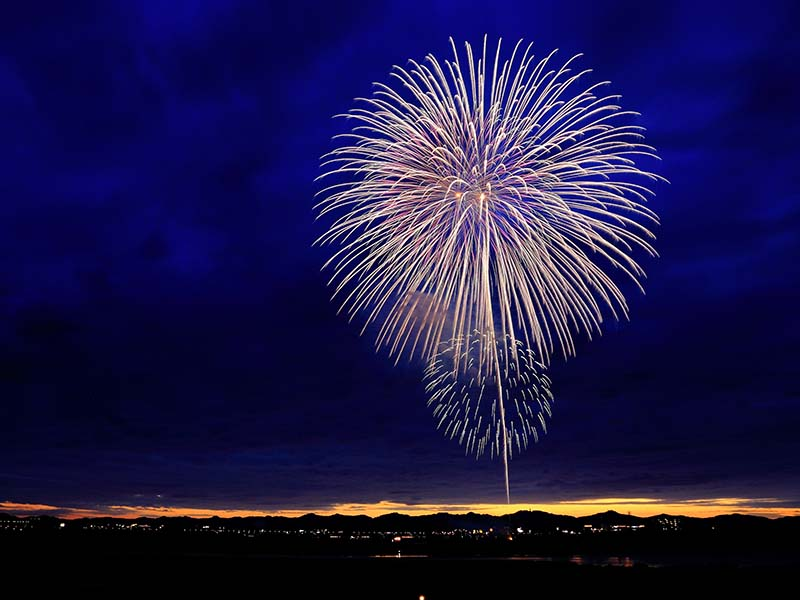

# Interaction Instructions

To begin, load the webpage containing the project. The canvas will automatically adjust based on the window size, initializing and displaying the animation. The animation will commence automatically, with concentric circles and surrounding patterns on the canvas undergoing cyclic motion from small to large and back, driven by set noise and frame count increments.

# Explanation of Animation Group Code Methods

## Animation Driving Method

In this animation project, I utilized *Perlin noise* and *random seeds* to drive the animation effects.

## Image Properties and Animation Techniques

The uniqueness of my personal code lies in dynamically adjusting the size of graphics using expansion factors calculated via sine functions. By employing `angleOffset`, each circle and pattern has a distinct initial position in the animation, creating unique motion trajectories. Leveraging Perlin noise functions, different random speeds and size variations are generated for each pattern, with `frameIncrement` and `frameCount` used to control the animation's frame rate and speed of variation.

#### 1. Animation of the Central Circle

The animation of the central circle utilizes the `sin` function and `expansionFactor` calculated using `frameIncrement` to achieve zoom in and out effects. By adjusting the radius, the central circle gradually expands and contracts, while colors appear sequentially and loop.

#### 2. Animation of Random Circles

Random circle animation involves utilizing Perlin noise to control random motion speed and `angleOffset` to control random angles. This causes circles of random colors to orbit the central circle at random speeds, with the `expansionFactor` adjusting the motion radius, achieving synchronous scaling with the central circle.

#### 3. Animation of Other Patterns

Animation of other patterns involves using Perlin noise to control random speed and utilizing `angleOffset` controlled random angles for circular motion around the central circle. Additionally, noise is used to achieve random size changes.

# Inspiration and References for Animated Effects

The creation of this animation code drew inspiration mainly from images of cosmic explosions and fireworks.



The concept of cosmic explosions inspired the overall expansion animation. The visual effect of an explosion manifests as the central point expands outward. By using sine functions and frame increments to simulate this expansion and contraction effect, concentric circular patterns representing the explosion center continuously expand, revealing structures of different color layers. Meanwhile, Perlin noise and frame control govern the motion of each circle and pattern representing different planets, collectively creating a dynamic sense of both disorder and order in the expanding explosion.

Concurrently, the visual effects of fireworks provided inspiration for the motion and trails of circles and patterns in the animation. By adjusting the background transparency, the trails of circles and patterns exhibit a dynamic aesthetic similar to fireworks blooming. Combining the characteristics of cosmic explosions and fireworks into the animation highlights their many similarities in process and imagery, symbolizing the vast material world of the cosmos and the brilliant civilization of humanity. In the grand scheme of time, much like fireworks, they may be dazzling yet ephemeral.

# Technical Explanation of Individual Code

## Modifications to Group Code

### 1. Newly Added Variables

To control the motion of circles and patterns in the animation, several variables have been added. These variables store the angle offsets, speeds, and noise offsets for each circle and pattern. Additionally, a small noise step is used to prevent abrupt changes in speed.
```
let angleOffsets = []; 
let speeds = []; 
let patternOffsets = []; 
let patternSpeeds = []; 
let noiseOffsets = []; 
let noiseStep = 0.01; 
let frameIncrement = 0;
```
### 2. Background Color

The background color has been changed, and transparency has been added to create a trail effect, causing previously drawn shapes to gradually fade on the screen, leaving a trail.
```
backgroundColor = color(0, 0, 0, 10); 
```
### 3. Initialization of Random Seed

To ensure the random number generator generates the same sequence each time, the random seed has been initialized.
```
randomSeed(42); 
```
### 4. Reinitialization of randomCircles

A loop is used to initialize the `randomCircles` array, replacing the method of individually adding objects in the group code. This loop generates a specified number of random circles, assigning each circle random coordinates, radius, color, angle offset, and noise offset.
```
for (let i = 0; i < 40; i++) {
  let x = random(1024);
  let y = random(1024);
  let r = random(5, 50);
  randomCircles.push({
    fill: smallCircleColors[int(random(smallCircleColors.length))],
    x: x,
    y: y,
    r: r,
    angleOffset: random(TWO_PI),
    noiseOffset: random(1000)
  });
}
```
### 5. Addition of patterns Array

A new `patterns` array has been defined, containing various types of patterns, each with angle offset and noise offset properties. This allows for the drawing of multiple different patterns in the animation, each with unique dynamic effects during motion.
```
patterns = [
  { type: 'duelCircle', x: 150, y: 780, radius: 30, delta: 10 },
  { type: 'duelCircle', x: 50, y: 30, radius: 15, delta: 5 },
  // Other patterns
];

for (let i = 0; i < patterns.length; i++) {
  patterns[i].angleOffset = random(TWO_PI);
  patterns[i].noiseOffset = random(2000);
}
```
### 6. Modification of draw Function

The draw function has been modified to enable the animation to scale overall based on frame count and sine function calculation results. Additionally, circles and patterns orbit the central circle and randomly change size.
```
function draw() {
  scale(scaleFactor);
  background(backgroundColor);

  let x = 512;
  let y

 = 512;

  frameIncrement += 0.01;
  let expansionFactor = 0.7 + sin(frameIncrement - 900) * 0.6;
  let baseRadius = 300 * expansionFactor;

  for (let r = baseRadius, i = 0; r >= 70; r -= 40, i++) {
    fill(largeCircleColors[i % largeCircleColors.length]);
    ellipse(x, y, r, r);
  }

  for (let i = 0; i < randomCircles.length; i++) {
    let circle = randomCircles[i];
    let noiseSpeed = noise(circle.noiseOffset + frameIncrement * noiseStep) * 1;
    let angle = circle.angleOffset + frameCount * noiseSpeed * 0.01;
    let radius = 300 * expansionFactor;
    let cx = x + radius * cos(angle);
    let cy = y + radius * sin(angle);
    fill(circle.fill);
    ellipse(cx, cy, circle.r * expansionFactor, circle.r * expansionFactor);
  }

  for (let i = 0; i < patterns.length; i++) {
    let pattern = patterns[i];
    let noiseSpeed = noise(pattern.noiseOffset + frameIncrement * noiseStep) * 2;
    let angle = pattern.angleOffset + frameCount * noiseSpeed * 0.01;
    let radius = 300 * expansionFactor;
    let px = x + radius * cos(angle);
    let py = y + radius * sin(angle);
    let noiseScalePattern = 0.5 + (noise(pattern.noiseOffset + frameCount * noiseStep) - 0.5) * 0.5;
    if (pattern.type === 'duelCircle') {
      drawDuelCircle(px, py, pattern.radius * noiseScalePattern * expansionFactor, pattern.delta * noiseScalePattern * expansionFactor);
    } else if (pattern.type === 'specialCircle') {
      drawSpecialCircle(px, py, pattern.outerRadius * noiseScalePattern * expansionFactor, pattern.innerRadius * noiseScalePattern * expansionFactor);
    } else if (pattern.type === 'complexCircle') {
      drawComplexCircle(px, py, pattern.outerRadius * noiseScalePattern * expansionFactor, pattern.middleRadius * noiseScalePattern * expansionFactor, pattern.innerRadius * noiseScalePattern * expansionFactor);
    } else if (pattern.type === 'moon') {
      drawMoon(px, py, pattern.moonRadius * noiseScalePattern * expansionFactor, pattern.offset * noiseScalePattern * expansionFactor);
    }
  }
}
```
## External Techniques Explanation
### 1. Dynamic Adjustment of Angle and Noise Offsets for Graphics
This technique comes from [https://chatgpt.com](https://chatgpt.com).
This technique involves storing angle offsets and noise offsets for each pattern. `angleOffsets` are used to dynamically adjust the angles of graphics, while `noiseOffsets` store the noise offsets for each pattern, facilitating the use of Perlin noise in the animation.
```
let angleOffsets = [];
let noiseOffsets = [];
```
### 2. Using Object Arrays to Store Pattern Information
This technique comes from [https://chatgpt.com](https://chatgpt.com).
Each object in the `patterns` array contains information about a pattern (type, position, radius, etc.). This approach facilitates drawing different patterns based on their types.
```
patterns = [
  { type: 'duelCircle', x: 550, y: 180, radius: 30, delta: 10 },
  { type: 'duelCircle', x: 650, y: 300, radius: 15, delta: 5 },
  // Other patterns
];
```
### 3. Conditional Statements to Check Pattern Type and Call Corresponding Drawing Functions
This technique comes from [https://chatgpt.com](https://chatgpt.com).
This technique involves using conditional statements to check the `type` property of the `pattern` object and call the appropriate drawing function. The `type` property is used to differentiate between different types of patterns.
```
if (pattern.type === 'duelCircle') {
  drawDuelCircle(px, py, pattern.radius * noiseScalePattern * expansionFactor, pattern.delta * noiseScalePattern * expansionFactor);
}
```
### 4. Drawing Arcs
This technique comes from [https://chatgpt.com](https://chatgpt.com).
Using the `arc` function to draw arcs at specified positions. The `x` and `y` parameters specify the center position, `2 * outerRadius` specifies the width and height of the arc, and `0` and `PI` specify the start and end angles of the arc.
```
arc(x, y, 2 * outerRadius, 2 * outerRadius, 0, PI);
```